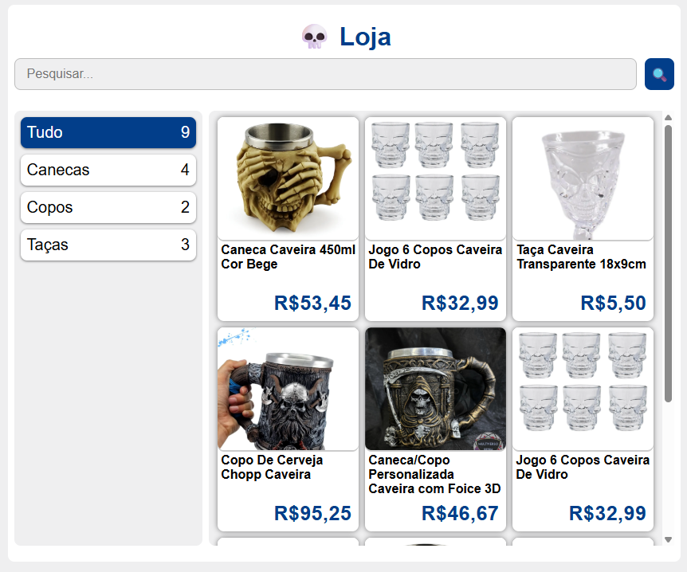

# Site de Loja Simples
🏆 Pequeno desafio que completei no curso da **TheHighway**. O objetivo era criar um site simples de loja que vendesse produtos da minha escolha.

🔗 https://ericravini.github.io/desafio-loja-caveiras/

---

## 🖼️ Imagem do projeto:

> Projetado apenas para desktop, não é responsivo com outros tamanhos de tela.

---

⚠️ EU NÃO TENHO O DIREITO DAS IMAGENS UTILIZADAS NO PROJETO! AS IMAGENS FORAM USADAS APENAS PARA FINS DE ESTUDO.
